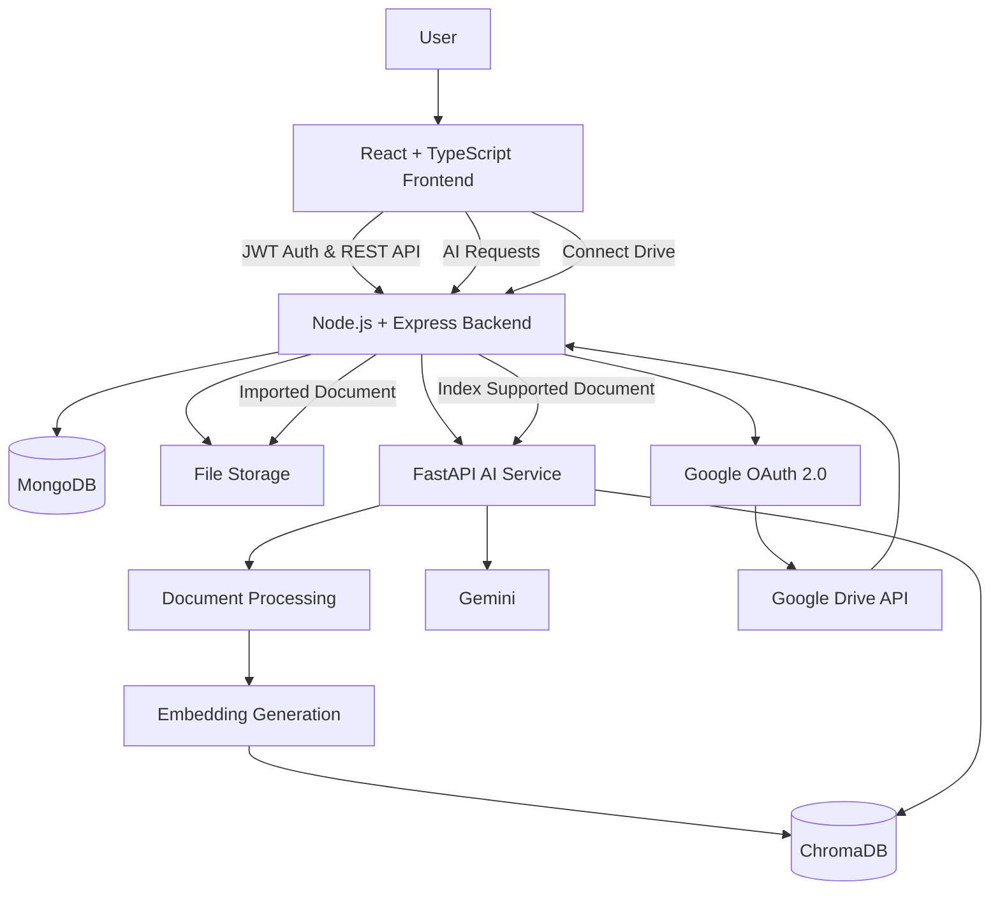

# ☁️ CloudVault

CloudVault is a full-stack cloud file management platform with **AI-powered document intelligence** and **Google Drive integration**.

It combines a React + TypeScript frontend, Node.js/Express backend, MongoDB persistence, Google OAuth 2.0, and a Python FastAPI RAG service to provide secure file management, external cloud imports, document summarization, and contextual AI question answering.

---

## ✨ Features

### 🔐 Authentication & Security

- User registration and login
- JWT-based authentication
- Protected frontend routes
- Protected backend APIs
- User-specific file access
- Persistent authentication
- Secure logout flow

### 📁 File Management

Users can:

- Upload files
- Browse stored files
- Preview supported documents
- Download files securely
- Delete files
- Search files
- Switch between list and grid views
- View file metadata
- Organize files through the CloudVault dashboard

File access is scoped to the authenticated user.

### ☁️ Google Drive Integration

CloudVault integrates with Google Drive using **Google OAuth 2.0**.

Users can:

- Connect a Google account
- Authorize read-only Drive access
- Browse files from Google Drive
- Import selected Drive files into CloudVault
- Access imported files through My Files

Imported supported documents can also enter the AI indexing pipeline.

### 🤖 AI Document Assistant

CloudVault includes an AI service built with **FastAPI** and a **Retrieval-Augmented Generation (RAG)** pipeline.

Supported AI functionality includes:

- Document ingestion
- Text extraction
- Text chunking
- Embedding generation
- Vector storage with ChromaDB
- Semantic retrieval
- AI document summarization
- Context-aware document Q&A
- AI chat interface

Users can select a document and ask questions based on its contents rather than relying only on general AI knowledge.

---

## 🧠 RAG Pipeline

CloudVault processes supported documents through a Retrieval-Augmented Generation pipeline.

```text
Document Upload / Google Drive Import
                │
                ▼
         Document Loader
                │
                ▼
         Text Extraction
                │
                ▼
          Text Chunking
                │
                ▼
      Embedding Generation
                │
                ▼
            ChromaDB
                │
                ▼
      Semantic Retrieval
                │
                ▼
     Relevant Document Context
                │
                ▼
         Gemini Generation
                │
                ▼
          AI Response
```

The retrieval layer associates indexed content with the corresponding CloudVault user and document, allowing relevant document context to be retrieved for AI interactions.

---

## 🏗️ System Architecture



---

## 🛠️ Tech Stack

### Frontend

- React
- TypeScript
- Vite
- React Router
- Axios
- Material UI Icons
- CSS

### Backend

- Node.js
- Express.js
- TypeScript
- MongoDB
- Mongoose
- JWT
- Multer
- Google APIs

### AI / RAG

- Python
- FastAPI
- ChromaDB
- Embeddings
- Retrieval-Augmented Generation
- Gemini

### External Integration

- Google OAuth 2.0
- Google Drive API

---

## 📂 Project Structure

```text
Cloud-Vault/
│
├── client/
│   └── src/
│       ├── api/
│       ├── components/
│       ├── context/
│       ├── hooks/
│       ├── layouts/
│       ├── pages/
│       ├── routes/
│       ├── services/
│       ├── styles/
│       ├── types/
│       └── utils/
│
├── server/
│   └── src/
│       ├── controllers/
│       ├── middleware/
│       ├── models/
│       ├── routes/
│       ├── services/
│       │   └── drive/
│       ├── types/
│       ├── utils/
│       └── validators/
│
├── ai-service/
│   ├── loaders/
│   ├── rag/
│   ├── vectorstore/
│   └── app.py
│
├── docker-compose.yml
├── .gitignore
└── README.md
```

---

## 🚀 Running CloudVault Locally

CloudVault consists of three application services:

```text
Frontend     → React + Vite
Backend      → Express + MongoDB
AI Service   → FastAPI + RAG
```

### 1. Clone the Repository

```bash
git clone <your-repository-url>
cd Cloud-Vault
```

---

### 2. Frontend Setup

```bash
cd client
npm install
npm run dev
```

The frontend runs locally through Vite, typically at:

```text
http://localhost:5173
```

---

### 3. Backend Setup

Open another terminal:

```bash
cd server
npm install
npm run dev
```

Create:

```text
server/.env
```

Example configuration:

```env
PORT=5000
NODE_ENV=development

CLIENT_URL=http://localhost:5173

MONGO_URI=your_mongodb_connection_string

JWT_SECRET=your_jwt_secret
JWT_EXPIRES_IN=7d

GOOGLE_CLIENT_ID=your_google_client_id
GOOGLE_CLIENT_SECRET=your_google_client_secret

GOOGLE_DRIVE_REDIRECT_URI=http://localhost:5000/api/drive/callback

AI_SERVICE_URL=http://127.0.0.1:8000
```

> Never commit real credentials or `.env` files to GitHub.

---

### 4. AI Service Setup

Open another terminal:

```bash
cd ai-service
```

Create and activate a virtual environment.

#### Windows

```powershell
python -m venv venv
.\venv\Scripts\activate
```

Install the dependencies required by the AI service, then start FastAPI:

```bash
uvicorn app:app --reload
```

The AI service runs locally at:

```text
http://127.0.0.1:8000
```

Configure the AI service with the environment variables required by the model/embedding implementation.

---

## 🔑 Google Drive Setup

To use Google Drive integration:

1. Create or select a project in Google Cloud Console.
2. Enable the Google Drive API.
3. Configure the OAuth consent screen.
4. Create OAuth 2.0 credentials for a web application.
5. Add the backend callback URL as an authorized redirect URI:

```text
http://localhost:5000/api/drive/callback
```

6. Add the Google client ID and client secret to `server/.env`.

CloudVault requests Google Drive access through OAuth and stores the required authorization information for the connected CloudVault account.

---

## 🔄 Google Drive Import Flow

```text
CloudVault
    │
    ▼
Connect Google Drive
    │
    ▼
Google OAuth 2.0
    │
    ▼
User Authorization
    │
    ▼
CloudVault Callback
    │
    ▼
Browse Drive Files
    │
    ▼
Select File
    │
    ▼
Import into CloudVault
    │
    ├────► File Storage
    │
    └────► AI Indexing Pipeline
             (supported documents)
```

---

## 🔒 Security

CloudVault includes:

- JWT authentication
- Protected React routes
- Protected Express routes
- User-scoped file access
- Authenticated file downloads
- OAuth-based Google Drive authorization
- Environment-based secret configuration

Generated files, local environments, vector databases, uploads, and secret environment files are excluded from version control.

---

## 🧪 Production Build

### Frontend

```bash
cd client
npm run build
```

### Backend

```bash
cd server
npm run build
```

Both applications can be compiled into production builds before deployment.

---

## 📸 Screenshots

Add screenshots of the application here.

Recommended screenshots:

### Landing Page

<!-- Add landing page screenshot -->

### Dashboard

<!-- Add dashboard screenshot -->

### My Files

<!-- Add file management screenshot -->

### Google Drive Integration

<!-- Add Google Drive screenshot -->

### AI Document Assistant

<!-- Add AI assistant screenshot -->

---

## 🌱 Future Improvements

Potential extensions include:

- Cloud deployment
- Additional cloud storage providers
- Folder synchronization
- File sharing permissions
- Advanced document search
- Expanded file-format support
- Background document indexing
- Improved AI retrieval evaluation
- Storage analytics and usage insights

---

## 💼 Project Highlights

CloudVault demonstrates practical experience with:

- Full-stack application architecture
- React and TypeScript development
- REST API design
- MongoDB data modeling
- JWT authentication and authorization
- Secure file management
- OAuth 2.0 integrations
- Google Drive API
- Python FastAPI services
- Vector databases
- Retrieval-Augmented Generation
- LLM integration
- Multi-service application architecture

---

## 📄 Resume Description

**CloudVault — AI-Powered Cloud File Management Platform**

Developed a full-stack cloud file management platform using **React, TypeScript, Node.js, Express, and MongoDB**, featuring JWT-based authentication, protected file operations, and Google Drive integration through OAuth 2.0. Built a **FastAPI-based Retrieval-Augmented Generation (RAG) service** using document chunking, embeddings, ChromaDB vector retrieval, and Gemini to enable AI-powered document summarization and contextual question answering.

---

## 👩‍💻 Author

**Twinkle Das**

GitHub: [Twinkle172](https://github.com/Twinkle172)

LinkedIn: [Twinkle Das](https://www.linkedin.com/in/twinkle-das-88a53a3b1)

---

## 📜 License

This project includes a `LICENSE` file in the repository.